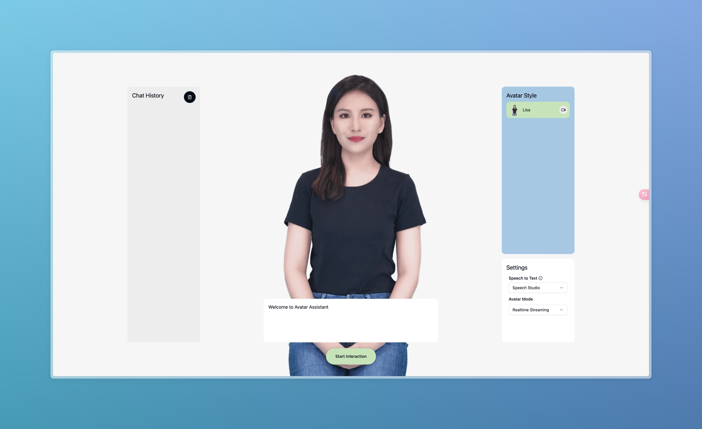

# Azure Avatar Demo

This project demonstrates the integration of Azure Avatar and Azure OpenAI services. Follow the instructions below to set up and run the project.



## Prerequisites

- Node.js (version 18 or higher)
- npm
- Azure account with access to Azure OpenAI and Azure Avatar services

## Setup

1. Clone this repository:

2. Install dependencies:

   ```bash
   npm install
   ```

3. Create a `.env` file in the root directory of the project and fill in the environment variables as shown in the `.env.example` file:

4. Start the development server:

   ```bash
   npm run dev
   ```

5. Open your browser and navigate to `http://localhost:5173` to see the demo in action.

## Usage

- Follow the on-screen instructions to interact with the Azure Avatar and Azure OpenAI services.
- Ensure your microphone is properly configured for voice interactions.

## Deployment

To build the project for production, run:

```bash
npm run build
```
